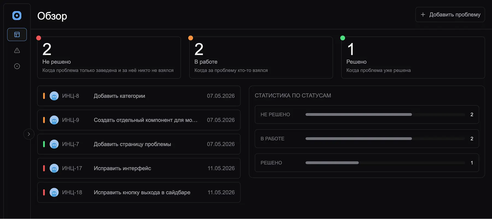

## инциденты

> Курсовая работа за 3 курс

[](https://wakatime.com/badge/user/42e0f82b-2688-4a48-85af-5eedd1812f70/project/f3aeb456-3b6e-42a5-8d2e-3be1ba379ffd)

Моно-репозиторий системы управления инцидентами с маршрутизацией обращений. Позволяет регистрировать и отслеживать проблемы. В сервисе реализована авторизация пользователя. Фичи реализованы как отдельный модуль, который может быть независимо подключён или отключён без изменения основной архитектуры приложения.

> ⚠️ Мультипользовательский режим в разработке. Требуется PostgreSQL.
>
> ⚠️ Не весь функционал готов



---

Стек: `Nuxt`, `TypeScript`, `Tailwind`, `Better Auth`, `Bun`, `Elysia`, `PostgreSQL`, `Oxc`, `VueUse`


---

## Фичи

- Авторизация
- CRUD инцидентов (создание, просмотр, редактирование, удаление)
- Маршрутизация проблем
- Статистика по статусам

---

## .env

Поля (отдельно для `frontend` и `backend`):

Фронтенд:

```env
NUXT_PUBLIC_AUTH_BASE_URL
```

Бэкенд:

```env
DATABASE_URL
BETTER_AUTH_SECRET
BETTER_AUTH_URL
GITHUB_CLIENT_ID
GITHUB_CLIENT_SECRET
BACKEND_PORT
```

## Запуск

#### Фронтенд

```bash
cd frontend
bun install
bun dev
```

#### Бэкенд

```bash
cd backend
bun install

bun prisma generate
bun prisma db push
bun dev
```
